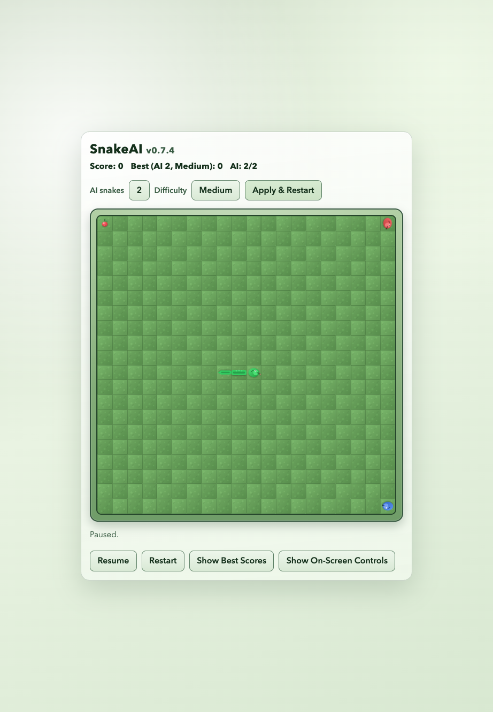

# Classic Snake (snake_ai)

Current version: `0.3.2`

Minimal browser-based Snake game built with vanilla JavaScript, HTML, and CSS. Features configurable AI opponents, sprite-based 2D visuals, and symmetric collision rules.



## What It Includes

- Grid-based snake movement with fixed tick loop (140ms per tick)
- Food spawning on unoccupied cells
- Snake growth and score updates when food is eaten
- Pre-game setup to choose `0-5` AI rogue snakes
- AI snakes that chase food using Manhattan distance, eat fruit, grow, die, and respawn after random delays
- AI snakes spawn from random corners and emerge from the wall over initial ticks
- Symmetric collision rules for player/AI and AI/AI (same-cell head and head-swap collisions)
- Game-over modal includes AI count selector synced with the main setup selector
- Persistent best-score tracking per AI count via localStorage (survives page reloads and server restarts)
- Game over on wall collision, self collision, or rogue collision
- Win/end state when the board is fully filled
- Restart and pause/resume controls
- Keyboard controls (`Arrow` keys + `WASD`) and on-screen touch controls
- 2D sprite visuals: green player snake, red/blue AI snake themes, animated food berry, and textured grass tiles

## Architecture

```
src/
  shared.js       Shared utilities (clampIntRange, clampRandom, toCellKey, cloneSnake, OPPOSITE_DIRECTIONS)
  highScoreLogic.js Pure score logic: per-AI best score normalization and updates
  gameLogic.js    Pure game state: movement, collisions, food, scoring
  rogueLogic.js   AI snake behavior: spawning, pathfinding, rogue collisions
  app.js          DOM rendering, event handling, game loop orchestration
  styles.css      Sprite rendering, layout, responsive design
  assets/         SVG sprites (player, rogue-red, rogue-blue, food, tiles)
```

- `gameLogic.js` and `rogueLogic.js` are pure logic with no DOM access, making them fully testable
- `app.js` orchestrates the game loop, wiring state updates to CSS-based sprite rendering
- State is immutable: all updates return new objects via spread

## Patch Notes

- `v0.3.2`: internal refactoring and performance improvements — consolidated duplicate utilities (`toCellKey`, `clampIntRange`), eliminated redundant DOM rebuilds in score panel, and removed wasted idle-tick work.
- `v0.3.1`: added persistent per-AI best score tracking with localStorage, plus a “Best Scores by AI” panel toggle.
- `v0.3.0`: upgraded board rendering with 2D sprite visuals for player snake (green head/body/tail), AI snakes (red/blue themes), animated food, and textured background/frame styling.
- `v0.2.1`: fixed rogue spawn rendering edge case where emerging off-board segments could appear on the opposite side of the grid.
- `v0.2`: added symmetric AI collisions (player/rogue and rogue/rogue head-on and head-swap detection) and updated documentation.
- `v0.1`: initial release with configurable 0-5 AI rogue snakes and basic game mechanics.

## Tech Stack

- Plain JavaScript modules (`src/app.js`, `src/gameLogic.js`, `src/rogueLogic.js`, `src/shared.js`, `src/highScoreLogic.js`)
- HTML/CSS UI (`index.html`, `src/styles.css`)
- SVG sprite assets (`src/assets/`)
- Node built-in test runner (`node --test`)

No external runtime dependencies are required.

## Run Locally

Requirements:

- Node.js 18+ (for test runner and npm scripts)
- Python 3 (used by the dev server script)

Install and run:

```bash
npm install
npm run dev
```

Open:

```text
http://localhost:4173
```

## Controls

- Configure AI snakes: choose count (`0-5`) and press `Start Game` / `Apply & Restart`
- At game over, change AI count in modal and press `Play Again` to restart with new value
- Move: `Arrow Up/Down/Left/Right` or `W/A/S/D`
- Optional mouse controls on desktop: toggle `Show On-Screen Controls`
- View per-AI best-score table: toggle `Show Best Scores by AI`
- Pause/Resume: `Space` or `Pause` button
- Restart: `R`, `Restart` button, or modal `Play Again`

## Scripts

- `npm run dev`: starts a static server on port `4173`
- `npm test`: runs logic tests in `tests/gameLogic.test.js`, `tests/rogueLogic.test.js`, `tests/shared.test.js`, and `tests/highScoreLogic.test.js`

## Test Coverage (Core Logic)

50 tests across four test files:

**Shared utilities** (`tests/shared.test.js`):
- `clampIntRange` clamping, truncation, and NaN handling
- `toCellKey` coordinate serialization
- `clampRandom` edge cases (NaN, negative, >= 1, valid pass-through)
- `cloneSnake` deep copy independence
- `OPPOSITE_DIRECTIONS` mapping correctness

**Score logic** (`tests/highScoreLogic.test.js`):
- Per-AI score map creation and normalization
- AI-count-specific best retrieval
- Record update behavior (new record vs no change)
- Ordered row projection for the “Best Scores by AI” panel

**Game logic** (`tests/gameLogic.test.js`):
- Movement per tick
- Growth + score increment when eating food
- Wall collision game-over
- Self collision game-over
- Filled-board end condition
- Reverse-direction input prevention
- Pause/resume toggling and game-over guard
- `stepState` no-op when paused or game over
- Direction input validation (invalid and duplicate inputs)
- Food placement on valid empty cells only (including full-board edge case)

**Rogue AI** (`tests/rogueLogic.test.js`):
- Rogue snake spawn, movement, growth, and respawn behavior
- Rogue spawn returns null when all corners are occupied
- Rogue segment collection and filtering by ID
- Rogue pathfinding with null food (random fallback)
- Rogue avoidance of other rogues' occupied cells
- Rogue/player and rogue/rogue collision outcomes (body-hit, same-cell head-on, and head-swap)

## Manual Verification Checklist

- Start game and verify snake moves continuously
- Choose different AI counts (`0-5`) and verify they apply on Start
- Confirm keyboard controls respond as expected
- Confirm touch/on-screen controls work on small screens
- Eat food and verify snake length + score increase by 1
- Verify AI snakes chase food, can eat fruit, and respawn after dying
- Verify player head into rogue body causes game over
- Verify rogue head into player body kills rogue and player survives
- Verify player/rogue head-on and head-swap collisions defeat both
- Verify rogue/rogue head-on and head-swap collisions defeat both rogues
- Hit a wall and verify game-over modal appears
- Hit snake body and verify game-over modal appears
- Pause and resume without state corruption
- Restart from both button and modal and verify score resets
